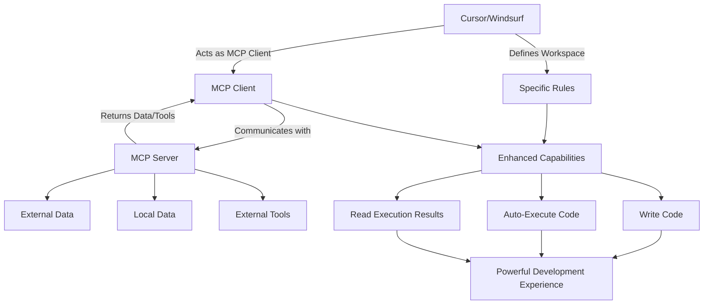

# RuleForge

Welcome to **RuleForge** – a centralized repository for collecting and sharing workspace rules and MCP server configurations for [Cursor](https://cursor.com) and [Windsurf](https://codeium.com/windsurf). Unlock the full potential of these powerful AI-driven IDEs by combining custom rules, Model Context Protocol (MCP) servers, and their built-in capabilities for code generation, execution, and result analysis.

## Why RuleForge?
Cursor and Windsurf are more than just code editors—they're platforms for automating workflows and enhancing productivity. By defining workspace-specific rules and integrating MCP servers, you can:
- Automate repetitive tasks
- Execute code and fetch results seamlessly
- Tailor the IDE to your project's needs



RuleForge aims to be the go-to place for developers to find, contribute, and refine these configurations.

## What's Inside?
- **Workspace Rules**: Predefined `.cursorrules` and `.windsurfrules` to customize your IDE behavior.
- **MCP Servers**: Ready-to-use Model Context Protocol configurations for connecting external tools and services.
- **Examples**: Practical use cases showcasing how to combine rules and MCP for real-world projects.

## Getting Started
1. **Clone the repo**:
   ```bash
   git clone https://github.com/Penn-Lam/RuleForge
   ```
2. Browse the `rules/` and `mcp_server/` directories for configurations that suit your needs.
3. Copy them into your Cursor/Windsurf workspace and tweak as necessary.
4. Follow the setup instructions in each folder to integrate with your IDE.

## Contributing
Have a killer rule or MCP server config? We’d love your contribution! 
- Fork this repo.
- Add your files to the appropriate directory (`rules/` or `mcp_server/`).
- Submit a pull request with a brief description of what your config does.

## Community
Join the discussion! Share your ideas, ask questions, or showcase your setups in the [Issues](https://github.com/Penn-Lam/RuleForge/issues) section.

## License
This project is licensed under the MIT License – see the [LICENSE](LICENSE) file for details.

Let’s make Cursor and Windsurf workflows smarter, together!
